
<h1 align="center">基于的信息技术知识赛系统的设计与实现</h1>

## 简介
基于Spring Boot的信息技术知识赛系统，提供用户登录、竞赛题库管理、自动评分、成绩统计功能。角色分为管理员和用户，支持题库管理、在线学习、赛事报名及信息管理，简洁易用。    --计算机毕业设计源码；毕设源码；java毕业设计源码

## 联系方式

<h3 align="center">获取完整代码与数据库文件 + 微信：deepguan QQ: 86050149 QQ群: 783742310</h3>

<h3 align="center">可帮忙远程部署 包运行成功！提供远程部署、修改代码、设计文档指导、代码讲解等服务！</h3>

## 功能介绍（完整见运行截图）
管理员：基本功能包括注册、登录和退出，提供后台管理功能，可以管理题库、用户和竞赛信息。此外，管理员可以进行比赛信息审核及成绩统计，并管理在线学习、赛前报名和公告信息。界面还提供用于查看和回复用户帖子、管理赛事报名和进行比赛题目添加与编辑的功能。用户：功能涵盖注册、登录和退出，能够参与在线学习和知识竞赛，访问赛事信息、公告和论坛等模块。用户可以查看和修改个人信息、提交答案参与测验，并查看实时成绩和比赛结果，还能在赛事论坛进行互动交流。

## 运行截图
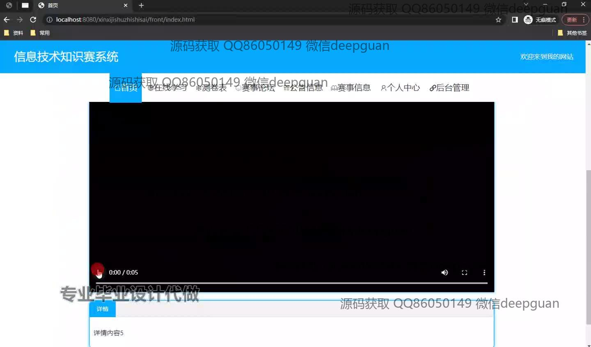
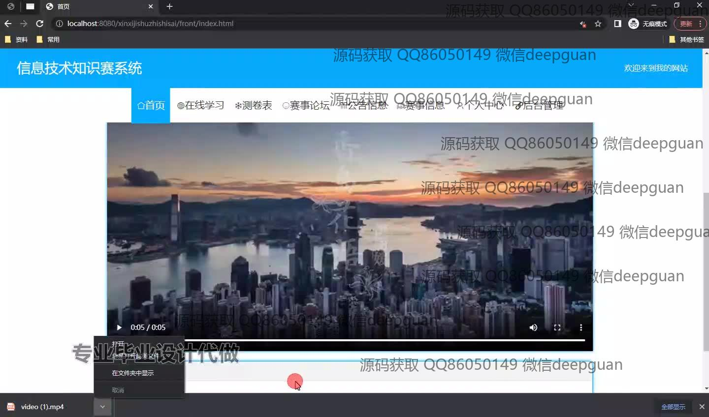
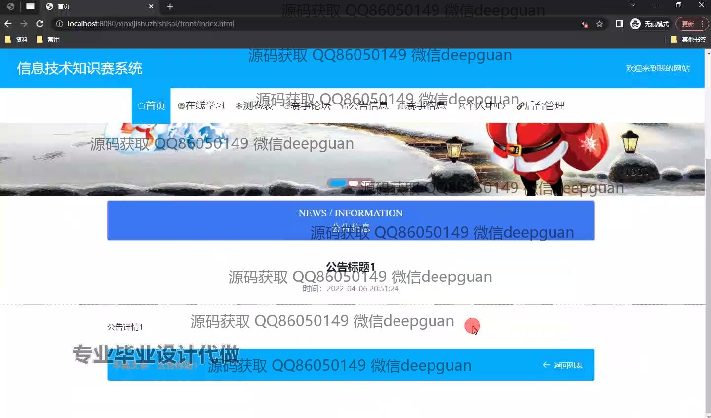
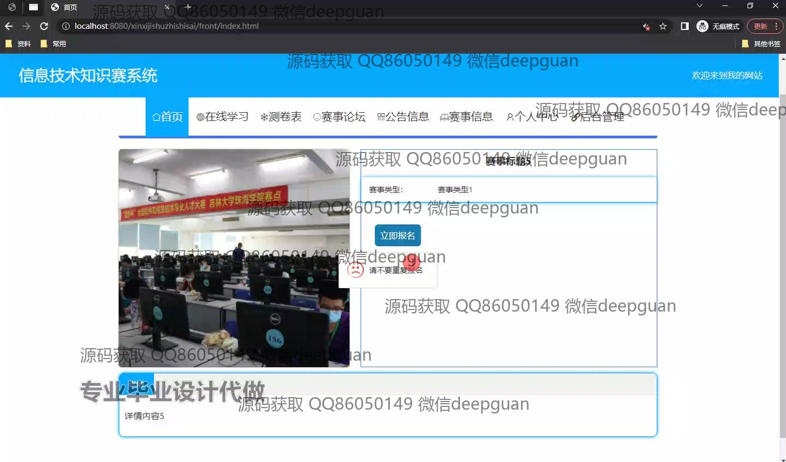
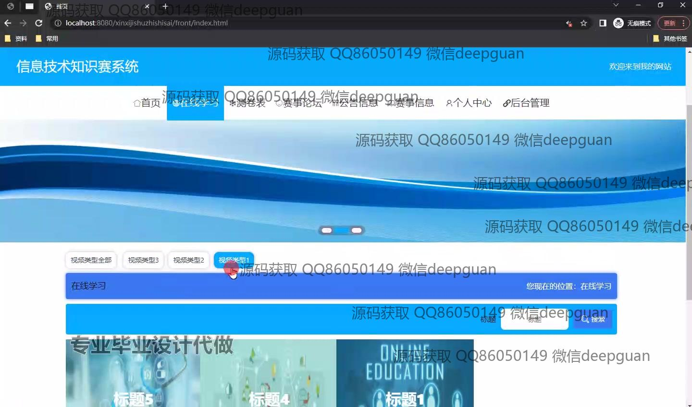
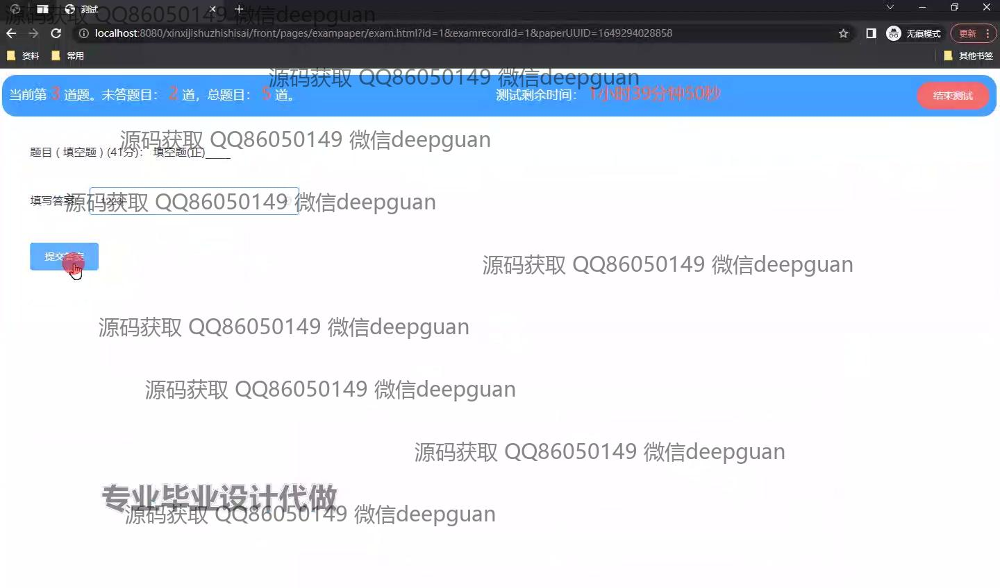
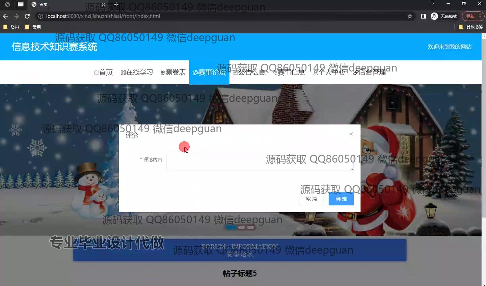
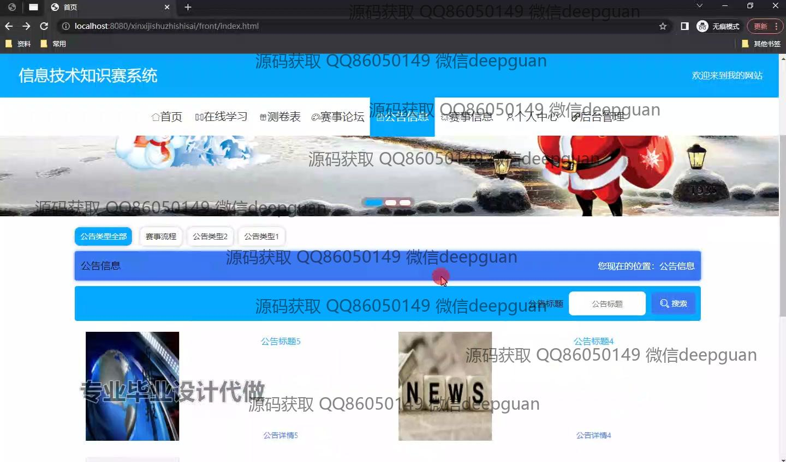
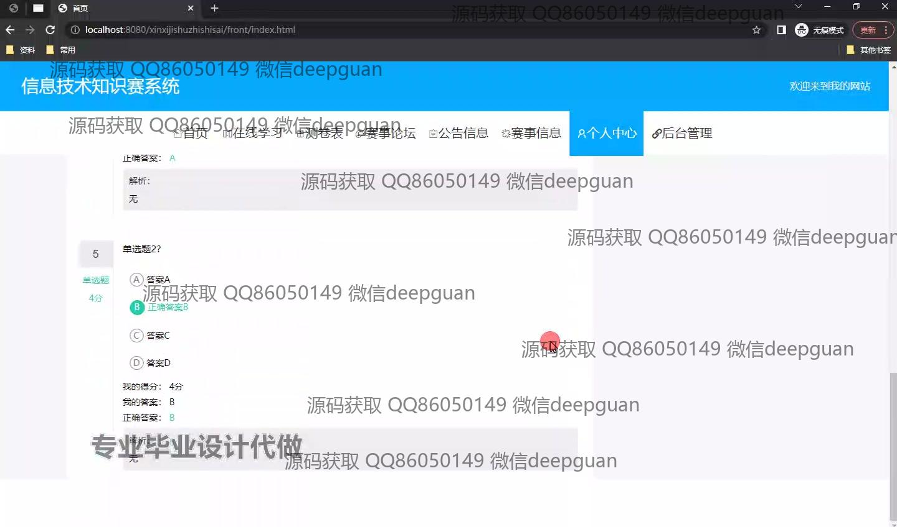
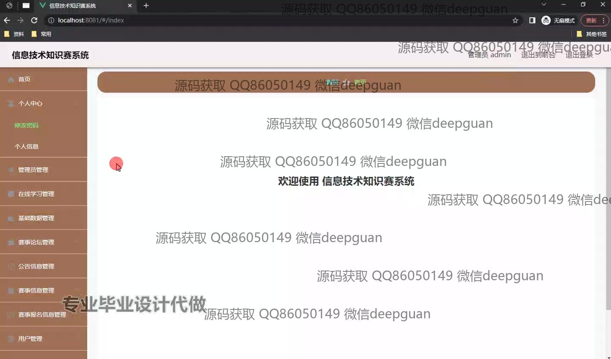
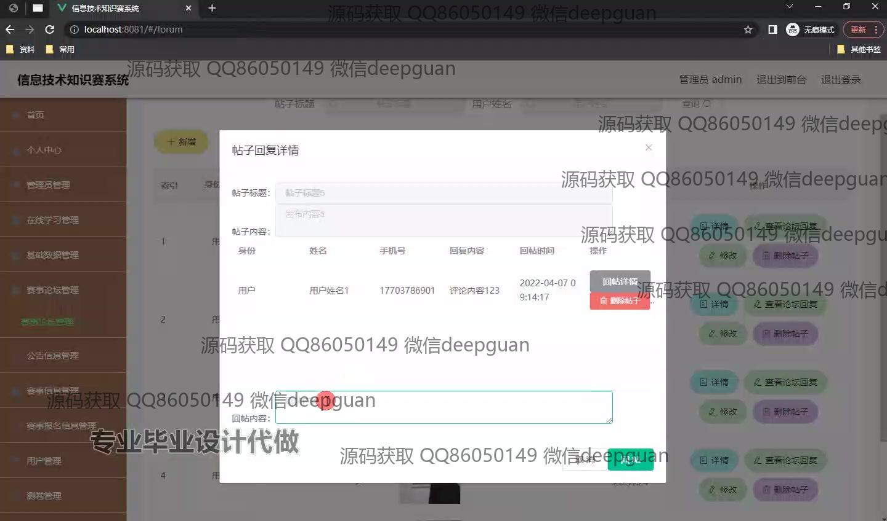
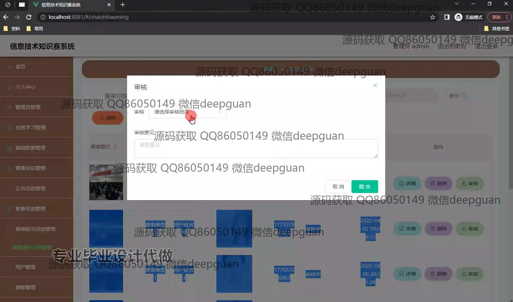
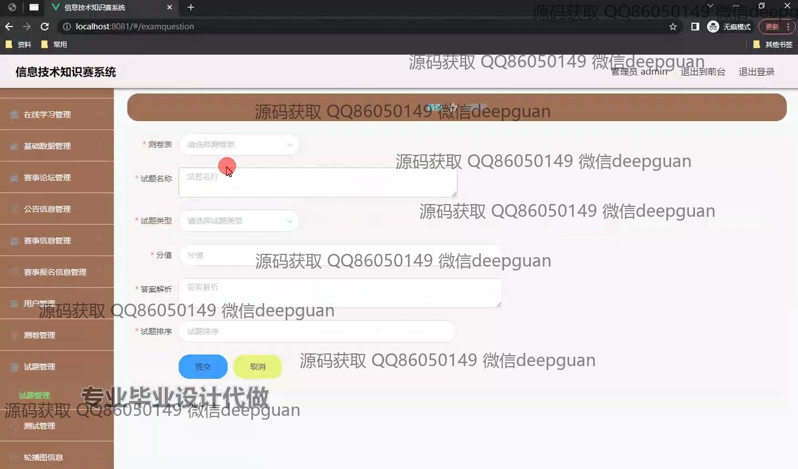
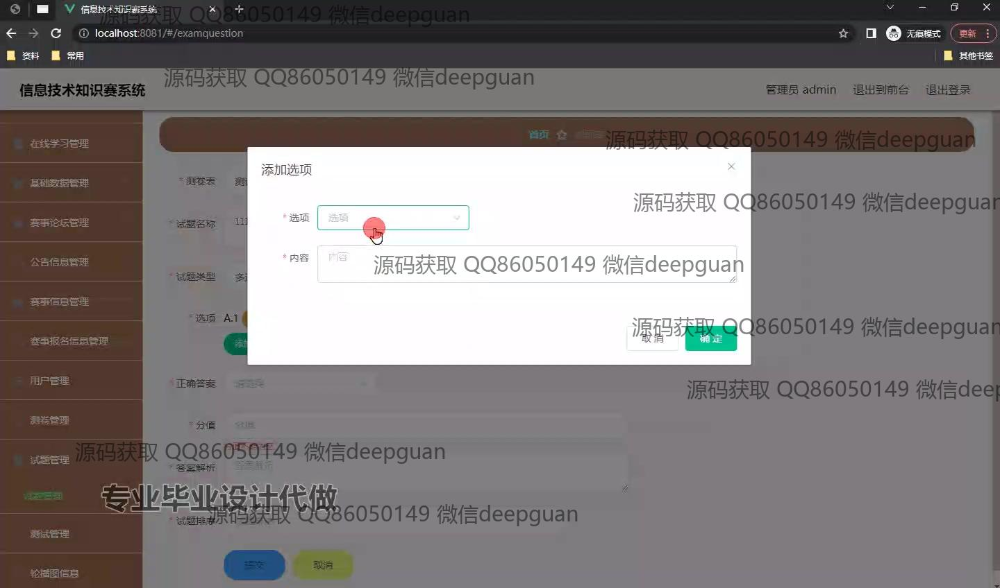
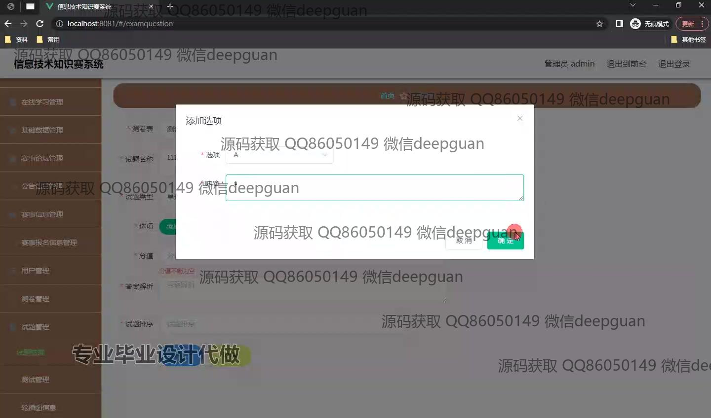
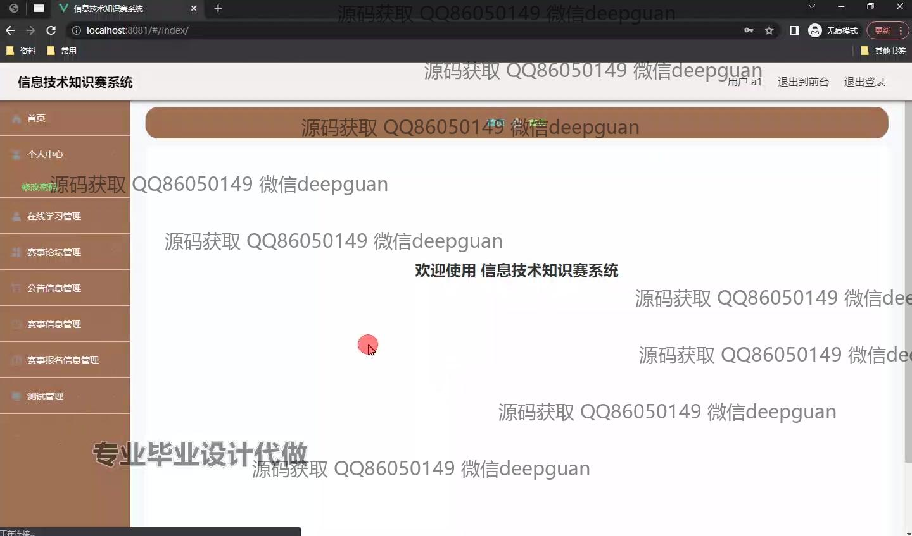
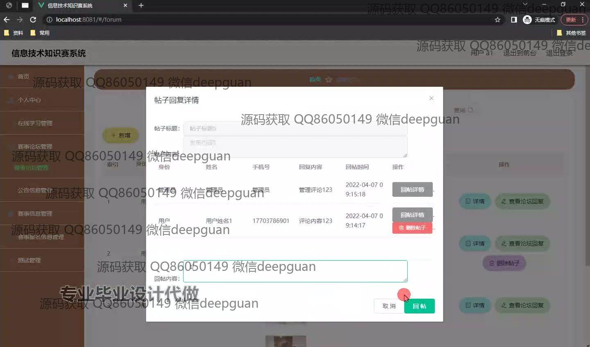
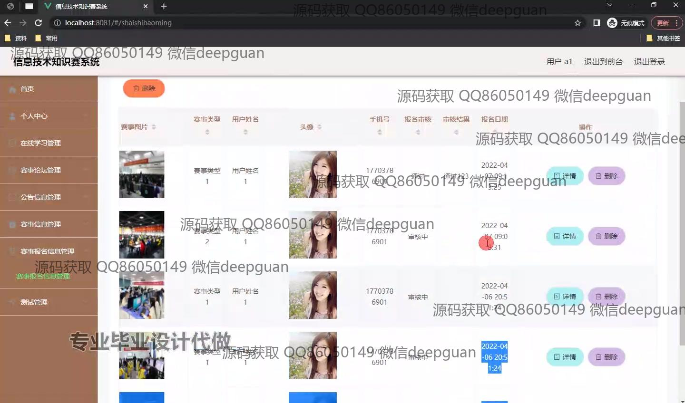

本代码来源于网络,仅供学习参考使用!

